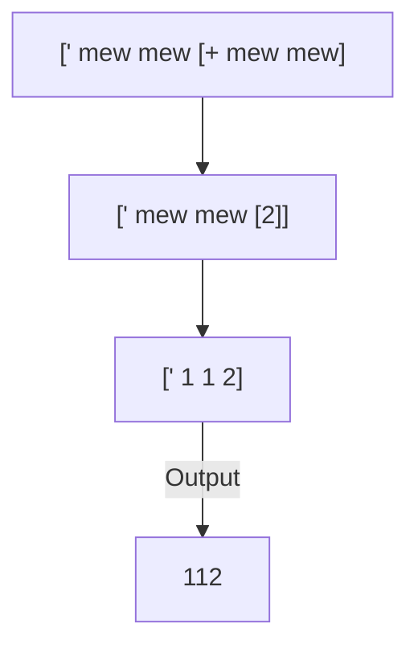
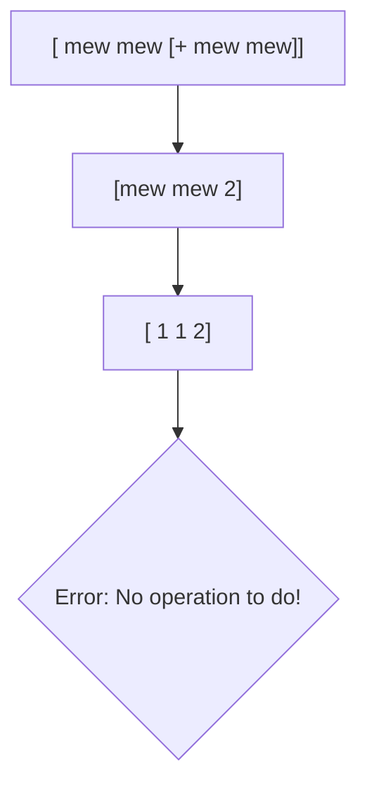

# Numbers

There is no concept of traditional numbers  in mewl instead we use `mew`s.
For example you want to write `5` you could do something like this

```lisp
mewmewmewmewmew
```

or maybe 2

```lisp
mewmew
```

So basically 1 `mew` is equivalent to 1; 2 `mew`s is equivalent to 2 and so on.

:warning:  Important Note: We don't have zero, to get zero we use subtraction `[- mew mew]` (it's like `1-1` = 0) [Mathematical operations will be discussed later]

But what about large numbers like 100 , 2022 , 500 or maybe `-10` , `-3.1`, for that we have some shortcuts, like these :
To write large numbers we can use mathematics, like `[* mewmew mewmewmewmewmew]` is equal to 10, or multiplying that expression with itself we can get 100. But that's cumbersome and complicated! Instead we have a simpler (relatively) syntax shortcut.
Lets write 100:

```lisp
[mew [- mew mew] [- mew mew]]
```

How about 2022:

```lisp
[mewmew [- mew mew] mewmew mewmew]
```

 Above two examples will only work when assigning to a variable, but if we want to use these expressions anywhere we have to put this **'** single single quote character just after the opening bracket. Something like this:

```lisp
[' mew mew [+ mew mew]] //is equal to 112
```

> 

It is being evaluated like this:



But If we remove this **'** character and it is not being assigned to a variable or being printed to the stdout, it is going to be evaluated like this and will throw an error:


